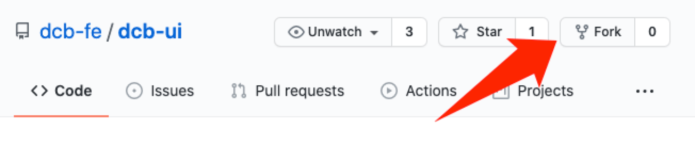
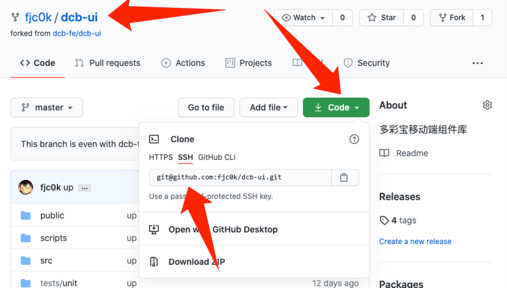
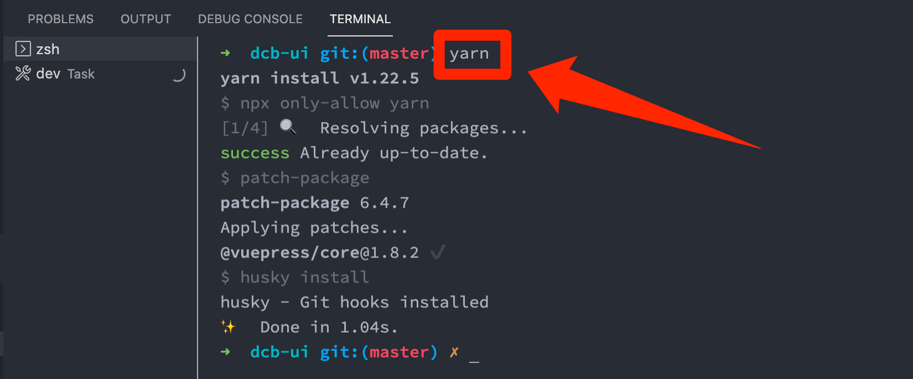
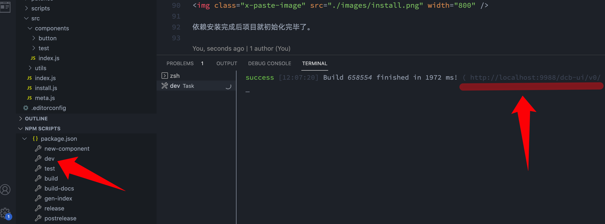
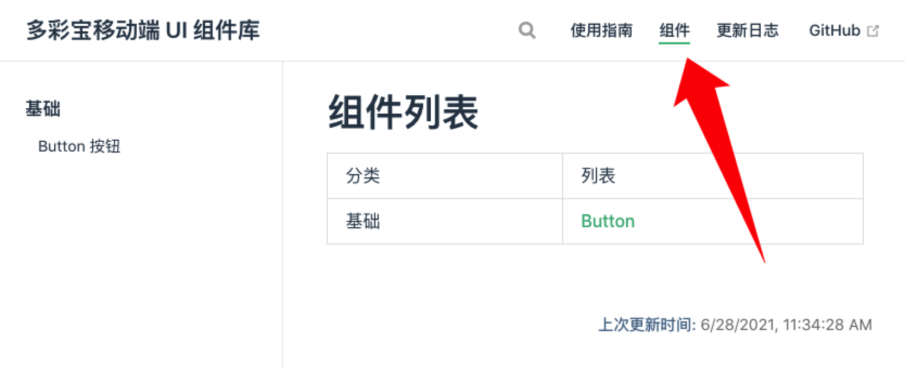
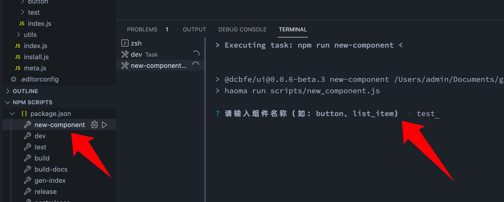
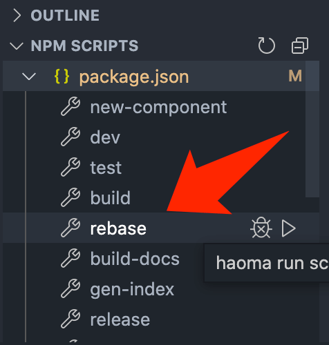
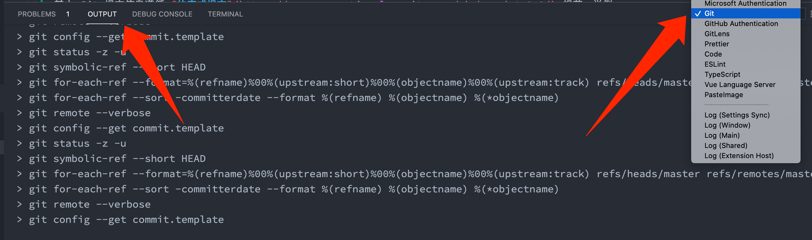
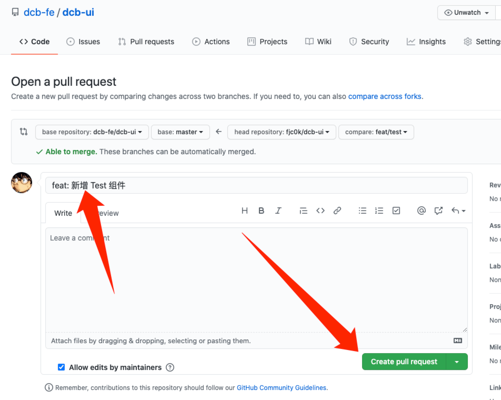

# 使用指南

## 安装

使用包管理器安装：

```bash
# 使用 yarn
yarn add @dcbfe/ui

# 或者，使用 npm
npm i @dcbfe/ui

# 或者，使用 pnpm
pnpm add @dcbfe/ui
```

若在国内，可使用 [tbify](https://github.com/fjc0k/tbify) 加速。

## 使用

在项目入口页（一般是 `src/main.js`）按需引入项目中要使用到的所有组件并注册即可。

由于 `@dcbfe/ui` 本身支持摇树优化，因此用这种方式只会引入你指定的组件，不会引入其他组件增加构建产物大小。

```javascript
import Vue from 'vue';

import { Button, Icon } from '@dcbfe/ui';
Vue.use(Button);
Vue.use(Icon);
```

你可使用下面的工具选择项目中要用到的组件生成代码：

<embed src="docs/guide/tool" />

引入组件后在项目中即可使用：

<demo src="docs/guide/usage" />

## 参与贡献

::: tip 前置要求

- 使用 [VSCode](https://code.visualstudio.com/docs) 作为 IDE。

  若尚未安装 VSCode，[可进入此处下载](https://code.visualstudio.com/download)。

- 使用 [Yarn](https://classic.yarnpkg.com/lang/en/) 作为包管理工具。

  若尚未安装 Yarn，可这样安装：

  ```bash
  npm i yarn -g --registry https://r.npm.taobao.org/
  ```

- 安装 [GitHub 桌面版](https://docs.github.com/cn/desktop/installing-and-configuring-github-desktop/installing-and-authenticating-to-github-desktop/installing-github-desktop)。

:::

### 1、Fork 仓库

打开 [dcb-fe/dcb-ui](https://github.com/dcb-fe/dcb-ui)，点击右上角 Fork 按钮：



### 2、克隆仓库

::: tip 提示

若你是首次克隆来自 GitHub 的仓库，你需要[在 GitHub 添加你的 SSH 密钥](https://docs.github.com/cn/github/authenticating-to-github/connecting-to-github-with-ssh/adding-a-new-ssh-key-to-your-github-account)。

:::

去到你 Fork 后的仓库，复制仓库的 SSH 地址：



将仓库克隆到你的电脑上：


### 3、创建分支

在项目中以 `master` 为基础创建分支，分支名最好以 `类型/作用域` 命名，如 `feat/button`、`fix/button`、`feat/icon`、`fix/icon` 等等。

### 4、初始化项目

切换去创建好的分支，在控制台输入 `yarn` 开始安装依赖：



依赖安装完成后项目就初始化完毕了。

### 5、开始开发

点击命令 `dev` 启动文档：



然后在浏览器打开文档，并切换到组件页：



### 6、添加组件

点击命令 `new-component` 选择组件分类、输入组件名、输入组件中文名后回车：



添加后的组件相关文件在 `src/components` 目录下。

### 7、编写组件

组件样式必须同组件设计（[蓝湖](https://lanhuapp.com/web/#/item/project/stage?pid=3e90f1e5-23df-4b27-9578-aade00912731&image_id=54c78a98-1cf5-4d02-b0ae-eab0b2f06b53)）一致，组件 API （属性、插槽、事件等）可参考 [Vant](https://vant-contrib.gitee.io/vant/#/zh-CN/button) 设计。

组件编写与日常开发无异，不过为了方便行事，做一些约定：

- 若组件有属性、插槽、事件，必须在组件定义时显式声明（目的在于方便组件 API 文档生成）。
- 组件样式采用 CSS Modules 设计，在组件模板中以 `_.类名` 引用具体类名（目的在于方便样式书写）。

以上约定的具体示例请参考 `src/components/button/button.vue`。

### 8、编写文档

组件文档位于组件同级目录下的同名 `.md` 文件中。

组件文档的具体示例请参考 `src/components/button/button.md`。

### 9、测试组件

组件测试逻辑位于组件同级目录下的同名 `.test.js` 文件中。

测试的目的就是让开发者敢加新功能（既有测试可告诉你这个新功能会不会产生 bug），让使用者敢采用（完善的测试说明这个东西基本没有什么大 bug）。

总体基于 [Jest](https://jestjs.io/zh-Hans/)、[Vue Test Utils](https://vue-test-utils.vuejs.org/zh/installation/testing-single-file-components-with-jest.html)。

- **逻辑**：采用单元测试。
- **视图**：采用快照测试。
- **样式**：不测试，由 UI 进行验收。

组件测试的具体示例请参考 `src/components/button/button.test.js`。

### 10、Git 提交

::: warning 提示

由于开发工作不可能一蹴而就，可能你在提交时，[dcb-fe/dcb-ui](https://github.com/dcb-fe/dcb-ui) 仓库（下称上游仓库）的代码已经发生了变化，但你 Fork 过来的代码是不会自动同步的。

因此，在每次提交前，必须手动更新下上游仓库的代码以保证代码同步。

首先，配置上游库（该操作仅需执行一次）：

```bash
git remote add upstream https://github.com/dcb-fe/dcb-ui.git
```

然后，在每次提交前这样操作：

- 首先，切换到 `master` 分支更新上游代码：

  ```bash
  git checkout master
  git pull --rebase upstream master
  ```

- 接着，再切换到我们创建的 `feat/xxx`、`fix/xxx` 等分支，同步代码：

  ```bash
  git checkout feat/xxx
  git rebase master
  ```

以上，我们的 `master` 分支仅是作为代码同步的作用，真正的开发在 `feat/xxx`、`fix/xxx` 等分支进行。

上述步骤略显繁复但有迹可循，因此我们准备了个脚本让你可以一键执行以上操作，点击 `NPM SCRIPTS` 下的 `rebase` 即可：


:::

Git 提交前会对代码进行如下检查，有一项不通过都会被阻止：

- 代码质量检查（通过 ESLint）；
- 文件命名检查（通过 lslint）：

  `src` 目录下的所有子目录、文件遵循下划线命名风格。举例：

  ```bash
  button
  list_item
  __demo__
  ```

- Git 提交信息格式检查（通过 commitlint）：

  遵循 [约定式提交](https://www.conventionalcommits.org/zh-hans/v1.0.0/) 规范。举例：

  ```bash
  # 新增特性
  feat: 新增 Button 组件

  # 解决 bug
  fix(Button): 点击应该触发 click 事件

  # 文档
  docs(Button): 完善 size 属性的描述

  # 杂项
  chore: 清理无用代码
  ```

若你的提交被阻止，请打开 Git 输出查看具体错误并改正后再次提交：



### 11、请求合并

将代码提交后，可到 GitHub 发起合并请求：


接着填写请求标题、请求内容，点击 `Create pull request`：



如果你的合并请求 CI 运行不通过，或者存在其他问题，可能会要求你修改后再提交。
